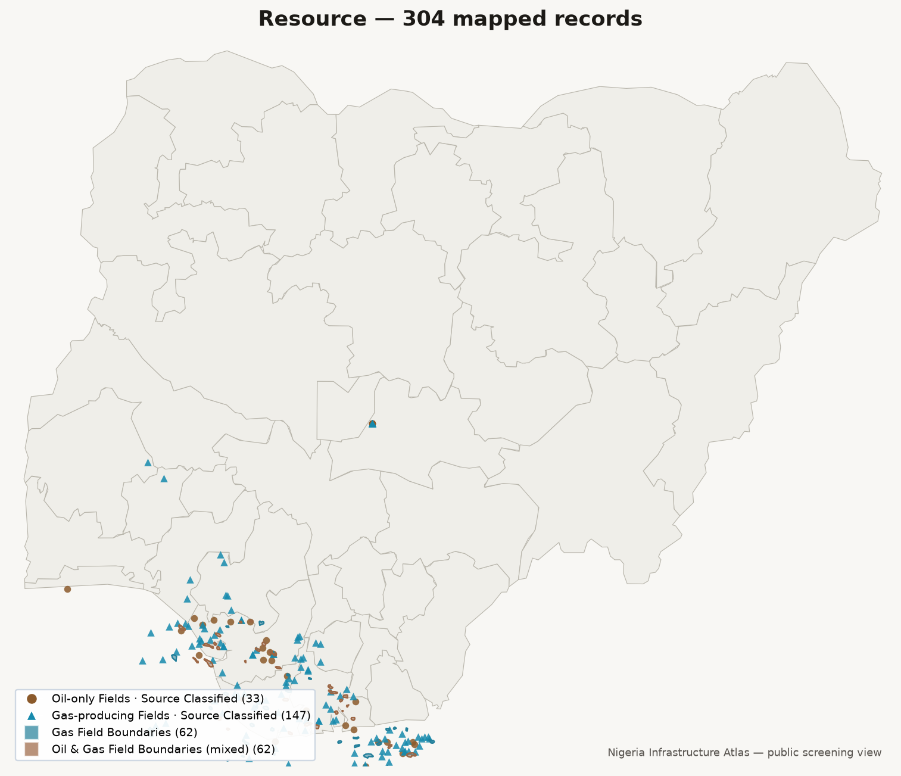
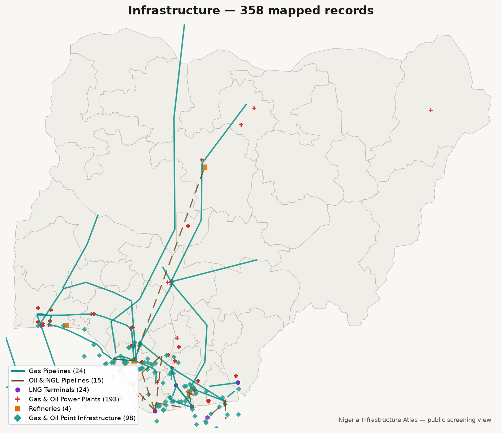
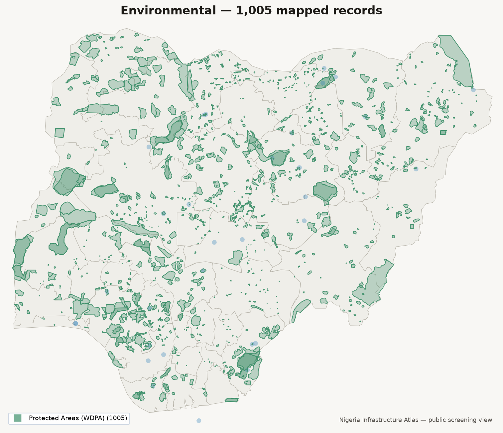
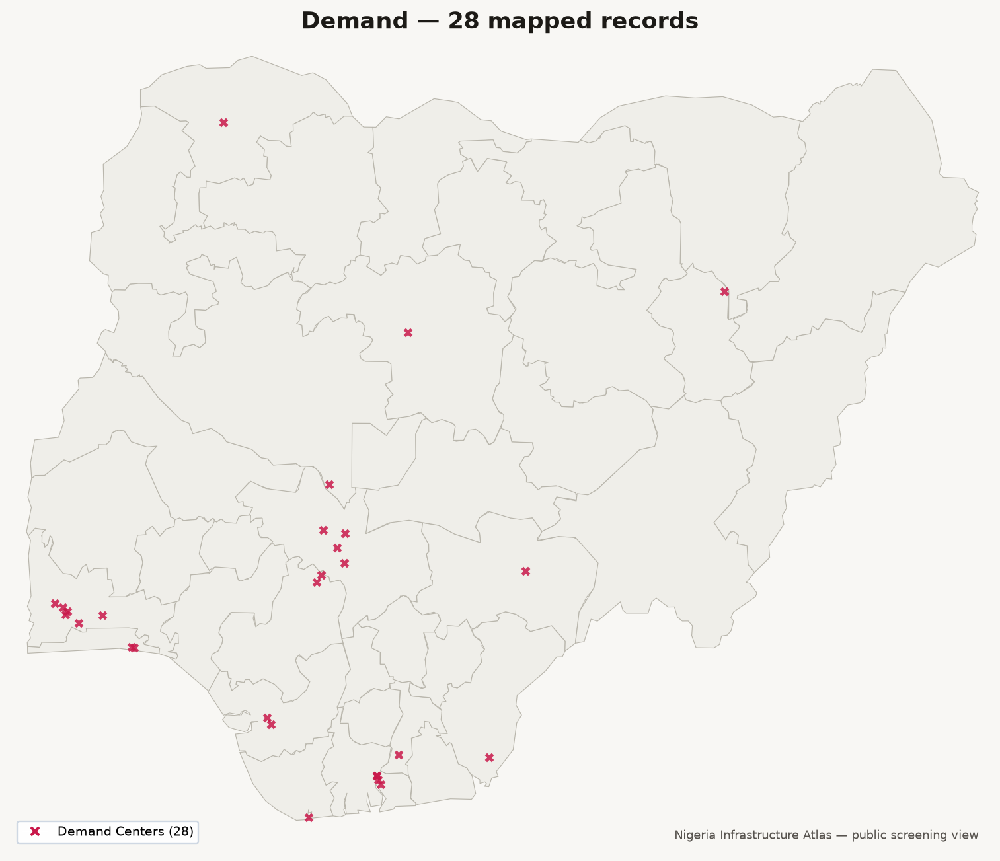
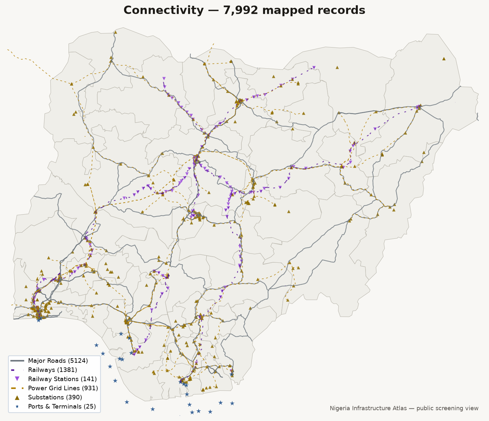
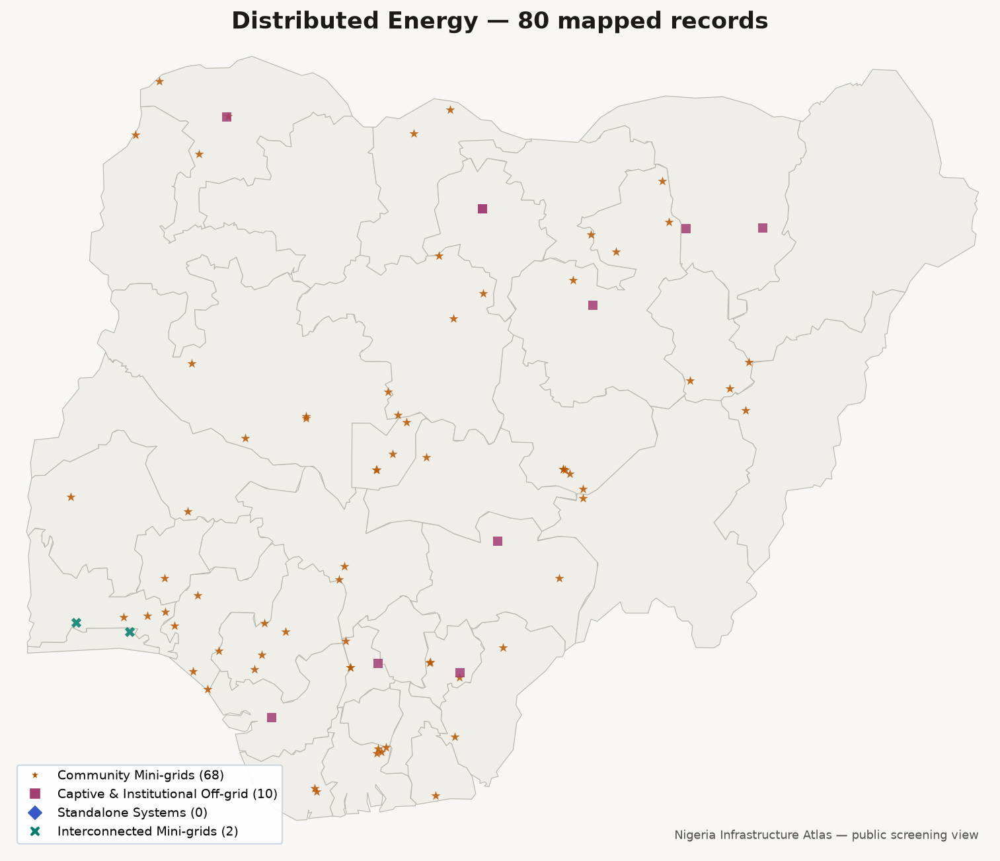
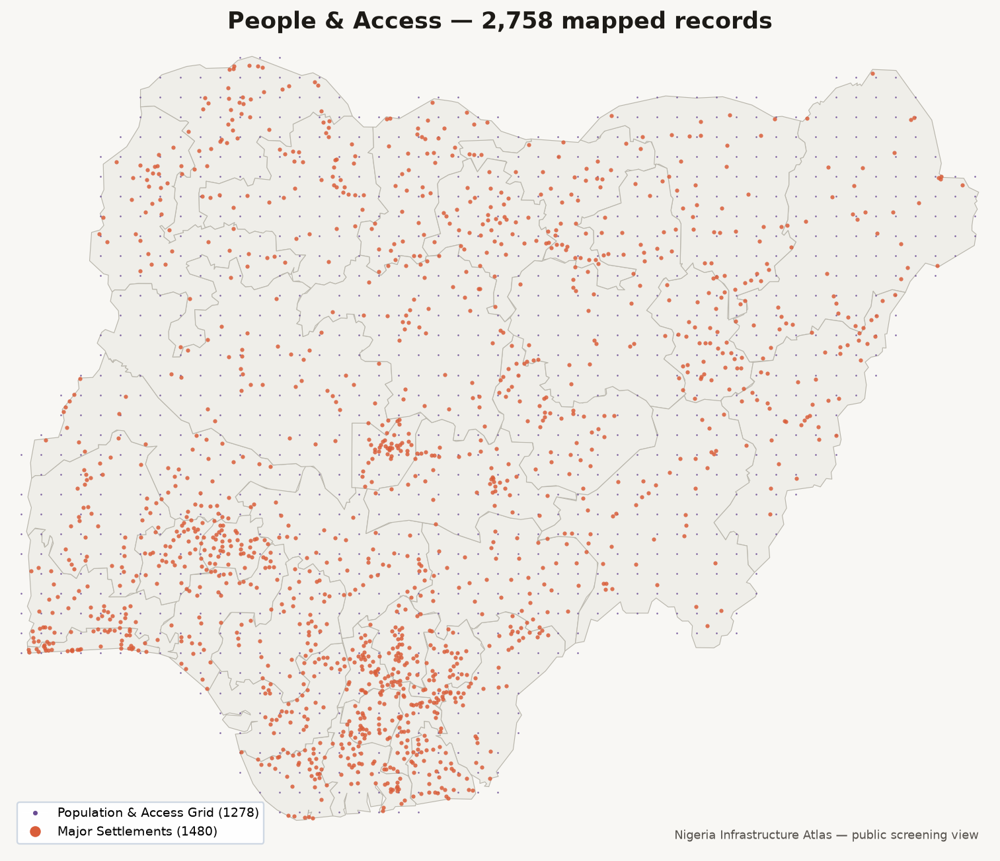

# Public map outputs

This folder collects ready-to-share visual artifacts for the Nigeria Infrastructure Atlas.

The canonical interactive public product is the Leaflet/GitHub Pages site in
`docs/`. HTML files generated in this output folder are exploratory and are not
the versioned public release.

The current snapshot is intentionally a public screening view. It is designed to show where major energy and distributed-energy assets appear in Nigeria, not to act as a complete or live operating registry.

## Layer gallery

`gallery/` holds one static PNG thumbnail per published atlas category, for
browsing without opening the interactive map — useful for READMEs, slide
decks, and quick visual QA. Each thumbnail is generated by
`scripts/build_output_gallery.py`, which reads the same
`docs/assets/atlas_data.json` bundle that powers the live site (not the raw
CSVs directly), so the gallery can never show something the interactive map
doesn't, and reuses that site's validated, colorblind-checked per-category
colors and shape vocabulary. Regenerate it after any run of
`scripts/build_public_atlas_data.py`:

```
python scripts/build_output_gallery.py
```

| Layer | Thumbnail | Records |
|---|---|---|
| Resource | [gallery/resource.png](gallery/resource.png) | 304 |
| Infrastructure | [gallery/infrastructure.png](gallery/infrastructure.png) | 358 |
| Environmental | [gallery/environmental.png](gallery/environmental.png) | 1,005 |
| Demand | [gallery/demand.png](gallery/demand.png) | 28 |
| Connectivity | [gallery/connectivity.png](gallery/connectivity.png) | 7,992 |
| Distributed Energy | [gallery/renewables.png](gallery/renewables.png) | 80 |
| People & Access | [gallery/context.png](gallery/context.png) | 2,758 |









All seven thumbnails are clipped to Nigeria's extent (matching `NIGERIA_BOUNDS`
in `docs/assets/app.js`), since a few GEM pipeline routes legitimately extend
into neighbouring countries (documented in `docs/data_sources.md`) and would
otherwise dominate the frame.

## Current snapshot

- `nigeria_public_asset_snapshot.png` — the main public-facing atlas snapshot, showing the current state-labeled context for power-producing plants, substations, demand centres, and mini-grids.
- `public_asset_benchmark_summary.json` — a machine-readable benchmark summary for the public atlas, including counts, state coverage, capacity coverage, customer coverage, status mix, and geocode precision.

## What the current snapshot says

The snapshot is best understood as a public screening view rather than a complete operating registry. In the current benchmarked layer:

- 193 power-producing plant records are shown
- 390 substation records are shown
- 28 demand-centre records are shown
- 80 catalogued distributed-energy records are shown across four explicit classes

The Distributed Energy section provides separate community mini-grid,
captive/institutional off-grid, standalone-system, and interconnected-mini-grid
views with evidence on status and technology mix.

## Benchmark interpretation

The companion benchmark file shows that the current mini-grid evidence is materially stronger than a generic programme page:

- 80 records across 30 states and the FCT
- 52 operational, 13 under construction, 13 commissioned, 1 under
  rehabilitation, and 1 unknown
- 66 Nigeria SE4ALL records plus 14 official-source additions
- 67 exact-site coordinates and 13 campus/community/facility coordinates

This means the public layer is strongest for:

- screening where distributed-energy assets appear
- benchmarking state-level coverage
- identifying likely project status and tech mix
- giving a transparent public picture of distributed-energy context

## What it does not claim

The public layer should not be interpreted as:

- a complete registry of all off-grid household solar systems
- a live commercial operating database
- a substitute for field verification or commercial diligence
- evidence that a state with zero catalogued records has no off-grid assets

## Intended usage

Use this map as a public summary figure for:

- investor-facing repo previews
- academic and student presentations
- practitioner briefing notes
- quick visual context before opening the processed CSV layer files

## Downloading and using the underlying datasets

The processed datasets are stored in `data/processed/` and are ready for analysis.

If users want to fetch the raw public inputs and reproduce the repo, run the layer-specific `01_download_*` and `0*_process_*` scripts in `scripts/`.

For applications, use this map for quick screening and use the processed CSV files for deeper asset, infrastructure, demand, or renewable planning analyses.
